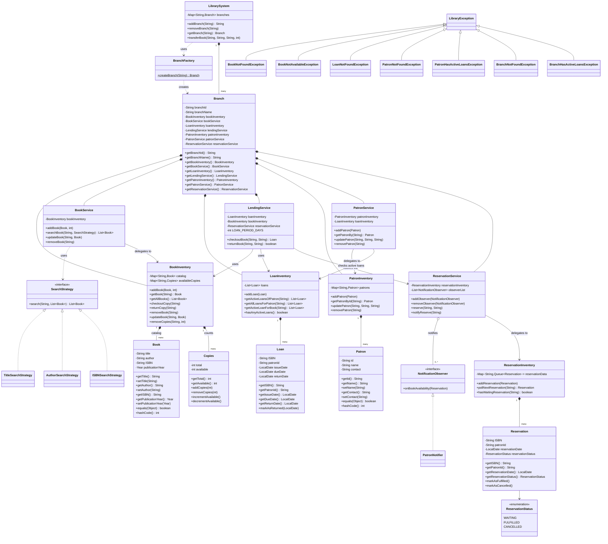

# Library Management System

A Java-based Library Management System demonstrating OOP concepts, SOLID
principles, and design patterns. Built without persistence — everything
lives in memory for the duration of a run.

## Features

- **Book management** — add, remove, update, and search books (by title,
  author, or ISBN)
- **Patron management** — register and update patrons; borrowing history
  derived from loan records
- **Lending** — checkout and return, with due dates and overdue-ready data
- **Inventory tracking** — available vs. total copies per title
- **Multi-branch support** — each branch runs its own independent catalog,
  inventory, and lending system; books can be transferred between branches
- **Reservations** — patrons can join a waiting list for a book that's
  checked out, and are notified automatically when a copy is returned

## Architecture Overview

The system is organized into four layers:

| Layer | Classes | Responsibility |
|---|---|---|
| **Entities** | `Book`, `Patron`, `Loan`, `Copies`, `Reservation`, `Branch` | Pure data holders (with minimal domain behavior where it belongs — see below) |
| **Data owners** | `BookInventory`, `LoanInventory`, `PatronInventory`, `ReservationInventory` | Each owns exactly one map/collection and is the single source of truth for that data |
| **Services** | `BookService`, `LendingService`, `PatronService`, `ReservationService`, `LibrarySystem` | Orchestration — validate, coordinate between data owners, enforce business rules |
| **Cross-cutting** | `SearchStrategy` (+3 impls), `NotificationObserver` (+ impl), `BranchFactory`, exception hierarchy | Design patterns and error handling |

A `Branch` bundles one full set of `BookInventory` / `BookService` /
`LoanInventory` / `LendingService` / `PatronInventory` / `PatronService` /
`ReservationService` — each branch is a self-contained mini-library.
`LibrarySystem` holds all branches and is the only place that reaches
across two branches (for transfers).

## Class Diagram

*Note: `Loan` and `Reservation` reference `Book`/`Patron` by ID (String), not by object — this is intentional (see "Loan and Reservation reference by ID, not by object" below) and is why no direct association arrow is drawn between them.*

## Design Patterns Used

### 1. Strategy — Book Search
`SearchStrategy` defines `search(query, books)`; `TitleSearchStrategy`,
`AuthorSearchStrategy`, and `ISBNSearchStrategy` each implement one
matching rule (partial/case-insensitive for title & author, exact match
for ISBN). `BookService.searchBook(query, strategy)` takes the strategy as
a parameter rather than branching internally — adding a new search
criterion (e.g. by year) means adding a new class, not touching
`BookService` (Open-Closed Principle).

### 2. Observer — Reservation Notifications
`ReservationService` acts as the **Subject**: it holds the waiting queue
(per ISBN) and a list of `NotificationObserver`s. `NotificationObserver`
is the observer interface (`onBookAvailability(Reservation)`);
`PatronNotifier` is the concrete implementation (console output here,
swappable for email/SMS later without touching `ReservationService`).
The trigger lives in `LendingService.returnBook()`, which calls
`reservationService.notifyReserve(isbn)` after a successful return.

### 3. Factory — Branch Construction
`BranchFactory.createBranch(name)` wires up all seven components a
`Branch` needs (inventories + services) in one place. Without it, every
call site that creates a branch would have to repeat the same
multi-step wiring. `Branch` itself still uses constructor injection
internally, so it stays testable — the factory is just a convenience
layer on top.

## Key Design Decisions & Trade-offs

**Book is title-level, not copy-level.** `Book` represents a catalog
entry keyed by ISBN; the *count* of physical copies is tracked
separately in `Copies` (owned by `BookInventory`). This mirrors how ISBN
actually works — one ISBN can back many physical copies.

**Mutability**: `Book` and `Patron` are mutable (setters for
non-identity fields) because metadata correction (typo fixes, contact
updates) is a real requirement, and immutability would force a
replace-the-whole-object pattern for a simple field edit. `Loan` and
`Reservation` are immutable except for their state-transition fields
(`returnDate` / `status`), exposed only through intention-revealing
methods (`markAsReturned()`, `markAsFulfilled()`, `markAsCancelled()`)
rather than raw setters — this keeps the *set of valid states* narrow
and self-documenting.

**Loan and Reservation reference by ID, not by object.** `Loan` stores
`isbn` and `patronId` as `String`s rather than embedding `Book`/`Patron`
objects. This avoids stale-reference bugs (a `Loan` shouldn't
silently reflect a later edit to a `Book`'s title), keeps serialization
trivial if persistence is added later, and mirrors how a relational
foreign key would work.

**No duplicate-loan restriction.** A patron *can* hold multiple copies
of the same title simultaneously — this assumption is deliberate and
documented here rather than enforced in code, to keep the lending flow
simple. It could be added later as a single check in
`LendingService.checkoutBook()` against `LoanInventory`.

**Patrons are branch-scoped.** A patron checks out and returns books
through one branch's `LendingService`; there's no cross-branch lending.
The *only* cross-branch operation is book transfer, handled by
`LibrarySystem`.

**Exceptions are unchecked**, all extending a common `LibraryException`
(itself a `RuntimeException`). This avoids `throws` clauses leaking
through every layer while still giving callers specific, catchable
types: `BookNotFoundException`, `BookNotAvailableException`,
`LoanNotFoundException`, `PatronNotFoundException`,
`PatronHasActiveLoansException`, `BranchNotFoundException`,
`BranchHasActiveLoansException`. Checkout distinguishes "ISBN doesn't
exist" from "ISBN exists but no copies left" so callers (and UIs) can
react differently to each.

**Copies protects its own invariants.** `incrementAvailable()` /
`decrementAvailable()` / `addCopies()` / `removeCopies()` all validate
internally (`0 <= available <= total`) even though `BookInventory`
already checks before calling them. This is deliberate defense-in-depth:
if another class ever calls `Copies` directly, the invariant still
holds.

## SOLID Principles

- **SRP** — each class has one reason to change: `Book` is data,
  `BookInventory` is stock/catalog storage, `BookService` is a
  librarian-facing facade, `LendingService` is checkout/return
  orchestration, `LoanRepository`-equivalent (`LoanInventory`) is pure
  storage/query.
- **OCP** — new search criteria (Strategy) or new notification channels
  (Observer) can be added as new classes without modifying
  `BookService` or `ReservationService`.
- **LSP** — any `SearchStrategy` or `NotificationObserver` implementation
  is interchangeable wherever the interface is expected.
- **ISP** — `NotificationObserver` exposes exactly one method; no class
  is forced to implement behavior it doesn't need.
- **DIP** — services depend on `BookInventory`/`LoanInventory`/etc. via
  constructor injection, not concrete construction, so they could be
  swapped or mocked in tests.

## Known Limitations / Not Implemented

- **No persistence** — everything resets on JVM exit, by design (out of
  scope per the assignment brief).
- **Not thread-safe** — `Copies` mutation (checkout/return) has a
  check-then-act race condition under concurrent access; acceptable for
  a single-threaded assignment scope, flagged here for completeness.
- **Recommendation system** — not implemented (optional extension).
- **Logging** — SLF4J + Logback wired up and used in `LendingService`;
  not yet extended to every class.

## Running It

`Main.java` walks through book/patron setup, search, checkout/return,
exception handling, the full reservation-and-notification flow, and
multi-branch transfer — see inline comments for each scenario.
